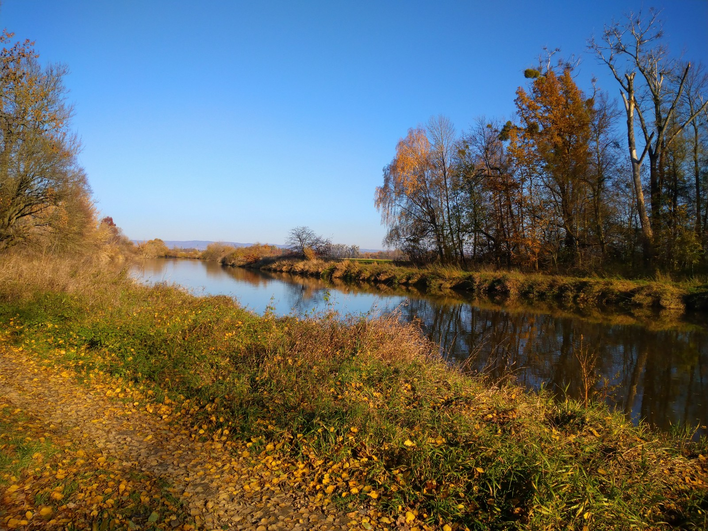

# dron-morava

## lokalita

* Blatecká štěrkovna
* původní záměr: Hlubočky
    * omezení letového provozu kvůli vojenskému prostoru Libavá

## sběr dat

* TODO

## zpracování dat

* snímky z dronu (cca 160), JPEG se souřadnicemi v EXIF
* Agisoft Metashape na učebně
    * *Workflow: Add photos; Align Photos; Build DEM; Build Photomosaic*
    * ořez polygonem (*outer boundary*)
    * *Export Photomosaic*
        * typ *Google Map Tiles* (PNG v ZIP)
        * zoom 14-21
* exportované dlaždice komprimovány `optipng`
    * cca 360 MiB → 310 MiB

## fotointerpretace

* TODO
* export do GeoJSON

## front-end

* TODO
